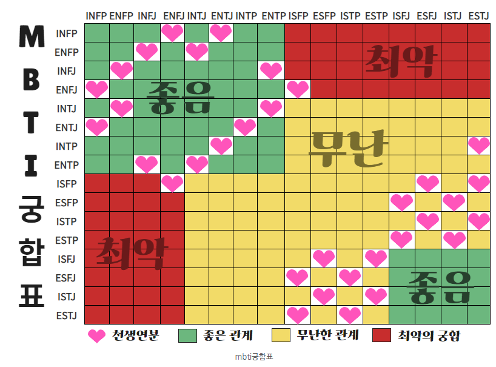
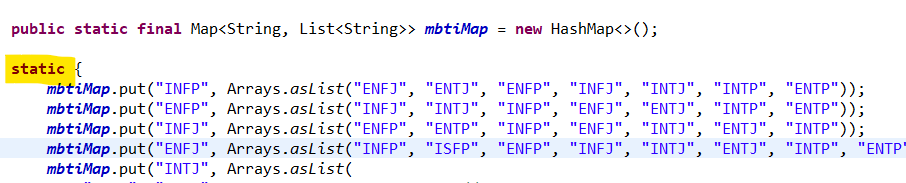
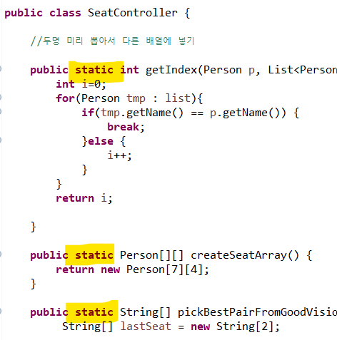
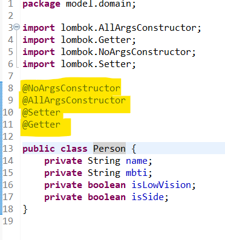
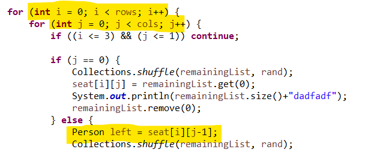
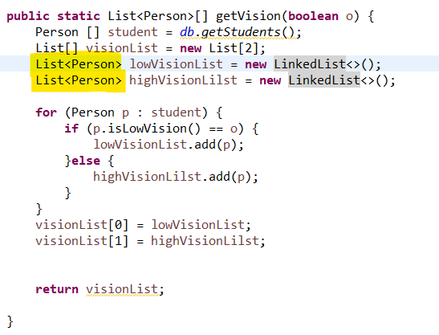
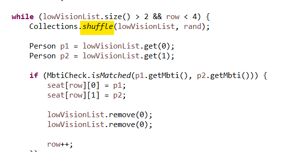

## 👨‍👩‍👧‍👦 팀 소개

**팀명**: 강고김김
**팀원**: 강한솔, 고태우, 김문석(팀장), 김동민

- **기획 및 설계**: 전원 참여 (주제 선정, 자리 배치 로직, 메서드 구조 설계)
- **코어 구현**: 고태우, 김문석
- **서브 구현**: 강한솔, 고태우
- **README.md 작성**: 강한솔, 고태우
- **발표 **: 고태우


# 👀 시력과 MBTI를 고려한 자리 배치 프로그램

우리FISA 클라우드엔지니어링 5기 미니 팀 프로젝트로,  
학생들의 **시력 정보**와 **MBTI 궁합**을 고려해 랜덤으로 자리를 배치하는 프로그램입니다.

---

## 📌 프로젝트 개요

- **목표**: 교실 내 자리 배치를 보다 합리적으로 자동화
- **핵심 고려 요소**:
  - 시력이 좋지 않은 학생 8명을 **앞줄 중앙**에 우선 배치
  - 나머지 학생들은 **MBTI 궁합을 고려**해 랜덤 배치
- **출력 방식**: Eclipse 콘솔 로그로 좌석 배열 출력

---

## 🛠 기술 스택

| 기술 | 내용 |
|------|------|
| Java | 전체 로직 구현 및 객체지향 구조 설계 |
| Maven | 프로젝트 의존성 관리 |
| Lombok | Getter/Setter 및 생성자 자동 생성 |

---

## 🔎 주요 기능

- 학생 정보(이름, mbti, 시력)를 Java 코드 내에서 직접 초기화
- 시력이 안 좋은 학생 리스트 셔플 및 지정 좌석 우선 배치
- 가장 뒷자리 2명은 시력이 안좋은 학생들 중에서 MBTI 궁합이 좋은 2명 배정
- 1열 먼저 랜덤 배정 오른쪽으로 MBTI 궁합 검증 후 배치
- 최종 자리배치 2차원 배열 형태로 출력

---

## 💡 MBTI 궁합 기준

자리 배치 시, 아래 MBTI 궁합표를 참고하여  
**최악의 궁합(빨간색)**에 해당하는 학생들이 나란히 앉지 않도록 로직이 구성되어 있습니다.




- ❌ **최악의 궁합 (빨간색)**: 좌석 배치 시 **피해야 할 조합**

> 궁합 판단은 해당 이미지를 기준으로 하였습니다.

---

## 🧩 실행 방법

1. Eclipse 또는 IntelliJ에서 프로젝트 클론
2. `StartView` 클래스 내 `main()` 또는 테스트 메서드 실행
3. 콘솔을 통해 자리배치 결과 확인

---

## 📁 디렉토리 구조


```
📦src
 ┣ 📂controller
 ┃ ┣ 📜.gitignore
 ┃ ┣ 📜LowVision.java
 ┃ ┣ 📜MbtiCheck.java
 ┃ ┗ 📜SeatController.java
 ┣ 📂model
 ┃ ┣ 📂domain
 ┃ ┃ ┣ 📜.gitignore
 ┃ ┃ ┗ 📜Person.java
 ┃ ┣ 📜.gitignore
 ┃ ┣ 📜Database.java
 ┃ ┗ 📜Model.java
 ┣ 📂view
 ┃ ┣ 📜StartView.java
 ┗ ┗ 📜SuccessView.java
```


---

## 🧠 학습 내용과 적용

이 프로젝트는 우리FISA 클라우드엔지니어링 수업에서 배운 내용을 실제로 구현해보며 실습한 결과물입니다.

### 🔸 static{}
- 각 Controller의 메서드, Database 생성시 static 사용
- Database 메모리 공유 가능, 빠른 접근성




### 🔸 Lombok
- Person객체에 NoArgsConstructor, AllArgsConstructor, Setter, Getter 사용
- 코드의 간결성, 생상성 향상 및 코드 가독성 증가

  


### 🔸 배열
- 인덱스와 length를 통해 좌석 배치 및 알고리즘 제어


### 🔸 예외처리
- catch-try 블록을 통해 좌석이 비었을 경우 에러메세지 출력

### 🔸 ArrayList
- 가변적이며 객체 타입만 저장 가능한 List 사용
- 시력이 나쁜 학생과 좋은 학생들의 list를 따로 생성해 알고리즘 구현
- Collections.shuffle()메서드 사용하여 랜덤 배치 구현
  

  


### 🔸 Git & 협업
- 팀원 간 역할 분담 및 GitHub 기반 협업

### 🔸 문제 해결 및 로직 설계
- MBTI 궁합 배치 알고리즘 직접 설계


---

## 🔧 향후 개선 방향 (Future Development)

### 1. 사용자 입력 기반 데이터 처리
- 현재는 Java 코드에 직접 학생 정보를 입력하고 있으나,
- 사용자로부터 입력받은 데이터를 기반으로 동적 처리 
  - 예: JSON 파일, 폼 입력, DB 연동 등

### 2. 유동적인 인원 수 처리
- 현재는 인원 수(30명, 시력 나쁜 학생 8명)가 고정
- 사용자 입력에 따라 인원 수가 유동적으로 처리되도록 개선 

### 3. 웹 기반 시각화
- 현재는 콘솔로만 결과 출력
- 향후 HTML/CSS 기반 **좌석 배치도 UI** 구현
  - Spring Boot + Thymeleaf 또는 React 등 사용 예정
  - 반응형 UI 및 실시간 랜덤 재배치 버튼 등 고려

---

## ✅ 요약

| 항목 | 내용 |
|------|------|
| 프로젝트명 | 시력과 MBTI를 고려한 자리 배치 프로그램 |
| 사용 기술 | Java, Maven, Lombok |
| 출력 방식 | 콘솔 로그 (Eclipse) |
| 향후 방향 | 웹 UI, DB 연동, 유동적 인원 처리 등 |

---

> 해당 프로젝트는 실습 기반의 교육 내용과 팀 협업 경험을 종합하여 개발된 결과물입니다.  
> 프로젝트 및 코드 개선에 대한 제안은 언제든지 환영합니다!

